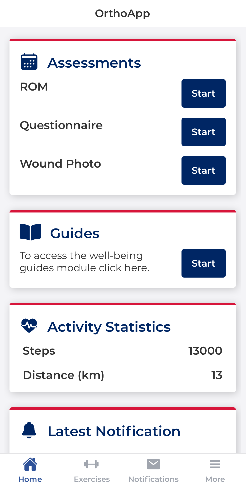
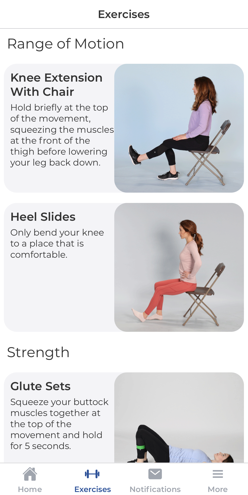
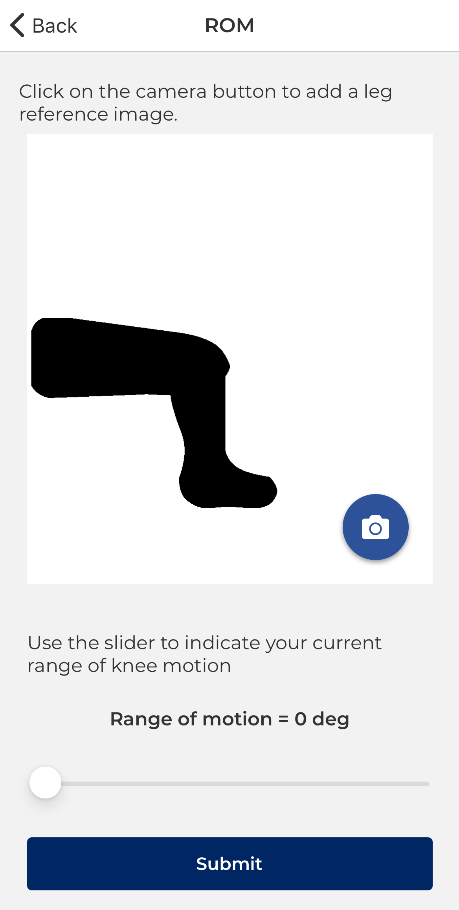
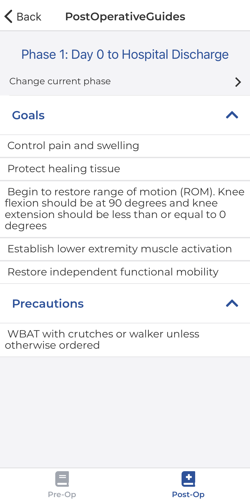
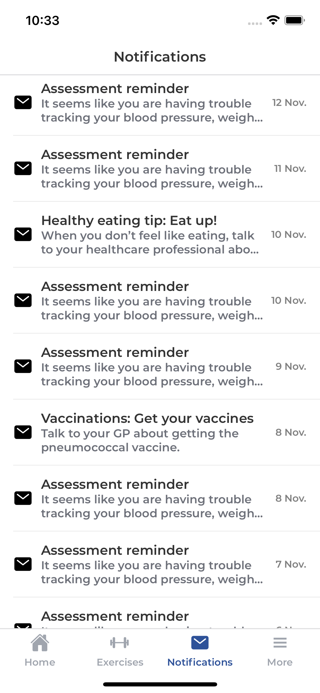
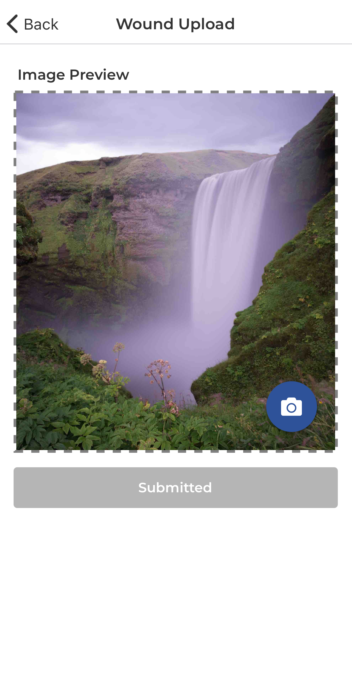

### Thesis - Application for Postoperative care of Orthopaedic Patients

The demand for hip and knee replacement procedures is steadily rising each year as the prevalence of osteoarthritis increases. This mobile application provides an economical alternative to traditional rehabilitation for orthopaedic patients.

There's a full [report](https://drive.google.com/file/d/11QQbEJHkhoSAiykp7OfeOrpgM3UIDt04/view?usp=sharing) if you're interested.

<h6> Scroll ⟵ left and right ⟶ to see screenshots of application features </h6>
<ul>
  <li> Home Screen</li>
  <li> Exercises</li>
  <li> Range of Motion</li>
  <li> Post-op Care</li>
  <li>  Clinical Notifications</li>
  <li> Wound Upload</li>
</ul>